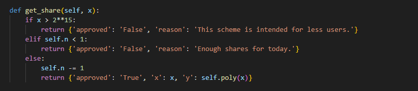

# HTB MSS Writeup — University CTF 2023

This is a writeup of an easy crypto challenge from HackTheBox University CTF 2023: Brains & Bytes.

>The solution I will discuss in this article is the unintented one (HTB later released a new challenge as a >patch of this challenge).

We were given a python script to locally test and see the encryption algorithm. After running the script, few instructions are printed and then we will be prompted for input.


The query prompt is taking a json input and executing the functions based on our input. Following code is handling the query parameter.


The functions that we are interested in are `get_share` and `encrypt_flag`. The `encrypt_flag` function simply encrypts the flag using a random key.

To get the encrypted flag we can simply write a simple json in the query prompt:

```
{"command": "encrypt_flag"}
```

The `encrypt_flag` function returns the hex values of iv and flag.

But to decrypt the flag, we first need to get the key. We have to use the `get_share` function for that.



The `get_share` function takes x as an argument. We can provide this value in the prompt:

```
{"command": "get_share", "x": [integer_value]}
```

If the value of x is less than 2¹⁵, it will call the poly function which will perfrom some calculations on the key based on the value of x we provide and return the result as y. Luckily, there is an unintended solution for this challenge. That is, if we provide 0 as the value of x, than the value of y will be the actual key (The poly function won’t change the value of our key).

So with that, we got our key, iv and encrypted flag. All we have to do now is just reverse the process using these values.

```python
from hashlib import sha256
from Crypto.Util.number import bytes_to_long
from Crypto.Cipher import AES
from Crypto.Util.Padding import unpad
import binascii


def decrypt_flag(key, iv, enc_flag):
    cipher = AES.new(key, AES.MODE_CBC, binascii.unhexlify(iv))
    pt = cipher.decrypt(binascii.unhexlify(enc_flag))
    unpadded_pt = unpad(pt, AES.block_size)
    return unpadded_pt.decode('utf-8')  # Assuming the flag is a string

# y obtained from get_share function
y = "920638201947337273643....."
key = sha256(str(y).encode()).digest()

# iv and enc_flag obtained from encrypt_flag function
iv = "5cf0fd859d432f....."
enc_flag = "3c3e867074d74d6aa....."

decrypted_flag = decrypt_flag(key, iv, enc_flag)
print(decrypted_flag)
```

By completing the values and running this script, we can decrypt the flag!

