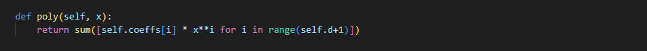

# HTB MSS-Revenge Writeup — University CTF 2023

In this writeup, I will walk you through MSS Revenge, an easy crypto challenge from HackTheBox University CTF 2023. This challenge was launched as a fix for MSS challenge as there was an unintended solution for MSS. I already wrote a writeup for that challenge. You can find it [here](unictf-mss.md).

In the previous challenge, we found a loophole through which we can obtain the encryption key by providing 0 as the value of x. So HTB realeased a fix and now we can only enter the value that is greater than 0. Besides that, this challenge is same as the previous one.

So diving in, the condition that changed in the new challenge lies in our `get_share` function:<br><br>


<br>
As you can see, if x is less than 1, it throws an error. So now we know that we cannot find the key directly. Instead we have to perform modular operation to reverse the process and get the initial value of the coeffs variable(the key).<br><br>


<br>
You can see here the first value of coeffs is the key that is used for encrypting.

The coeffs is a list that is later summed up using `sum()` function. If somehow we can reverse the process and reach the initial value, we will get our key.<br><br>




<br>
To get that, we have to obtain few values of y with respect to x and compare them. Precisely, we have to obtain 18 values as we only get limited tries.

After obtaining the x and its corresponding resulting values, we can CRT(chinese remainder theorem) module from sumpy library.


```python
from sympy.ntheory.modular import crt

key = int(crt(X, resulting_values)[0])
print(key)
```


And we will get the key through this process. All we have to do now is decrypt the flag using this key. We can use the same algorithm we used in the previous challenge:<br><br>

```python
from hashlib import sha256
from Crypto.Util.number import bytes_to_long
from Crypto.Cipher import AES
from Crypto.Util.Padding import unpad
import binascii


def decrypt_flag(key, iv, enc_flag):
    cipher = AES.new(key, AES.MODE_CBC, binascii.unhexlify(iv))
    pt = cipher.decrypt(binascii.unhexlify(enc_flag))
    unpadded_pt = unpad(pt, AES.block_size)
    return unpadded_pt.decode('utf-8')  # Assuming the flag is a string

# y obtained from get_share function
y = "435084058043250435....."
key = sha256(str(y).encode()).digest()

# iv and enc_flag obtained from encrypt_flag function
iv = "2c8c02e9a2d721f92....."
enc_flag = "298cf2aec2316f....."

decrypted_flag = decrypt_flag(key, iv, enc_flag)
print(decrypted_flag)
```

<br><br>

<br>

And here is the Flag!
<br>
<br>